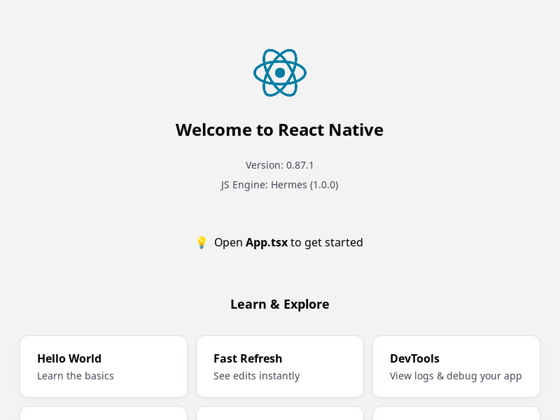
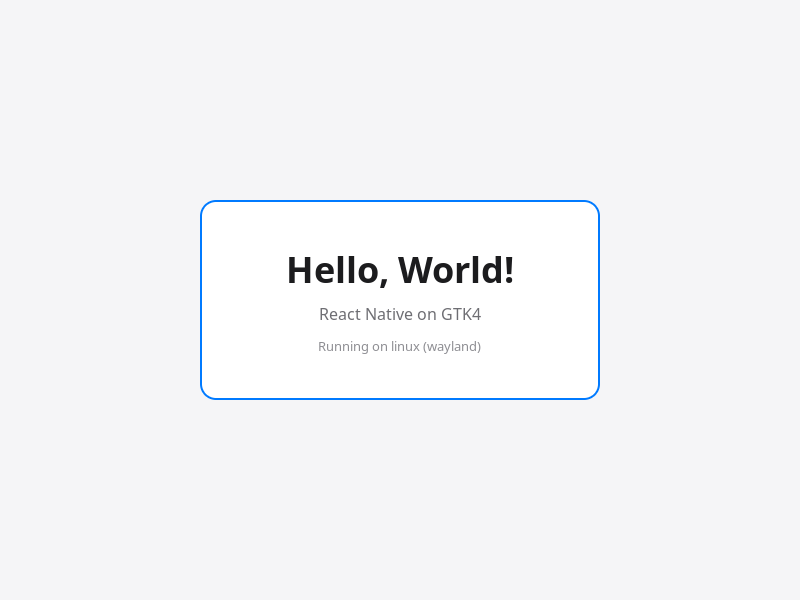

# react-native-gtk4

React Native for Linux, rendered with GTK4. An out-of-tree platform package
in the spirit of [react-native-windows](https://github.com/microsoft/react-native-windows)
and [react-native-macos](https://github.com/microsoft/react-native-macos),
published as `@curiosity26/react-native-gtk4` on GitHub Packages.

**Status: Phases 1 (core), 2 (desktop) and 3 (desktop parity) complete.** The GTK host runs React Native
0.87.1 (Hermes, Fabric). `<View>` and `<Text>` render RN's styling with GSK
and Pango: borders, radii, shadows, transforms, filters, gradients, nested
text. Mouse and touch input drive Pressable, the Touchables, Button and
hover. ScrollView scrolls with GTK's kinetic scrolling, FlatList and
SectionList virtualize 10k rows, and Image loads assets, http, files and
data URIs. TextInput, Switch and ActivityIndicator are GTK's own
controls (input methods, clipboard and undo included). See
[docs/components.md](docs/components.md). Apps bundle for their own `linux`
platform: `Platform.OS === 'linux'`, `.linux.js` files, and Linux
`Platform.constants` (distro, GTK version, Wayland or X11). In development
apps load from Metro, with reload, fast refresh, LogBox and React Native
DevTools; `fetch`, `XMLHttpRequest` and `WebSocket` run on libsoup
([docs/dev-loop.md](docs/dev-loop.md)). The CLI adds Linux to any React
Native app: `init-linux` and `run-linux`.

**Phase 2 (desktop):** dark mode (`Appearance`,
`useColorScheme`, libadwaita `PlatformColor`s that follow the desktop's
style, [docs/apis.md](docs/apis.md)); text selection by mouse; keyboard
focus, Tab order, focus rings and key events, `onMouseEnter`/`Leave`,
`onAuxClick` and `tooltip`, with react-native-windows / react-native-macos
props ([docs/components.md](docs/components.md#keyboard)); accessibility
for Orca through AT-SPI, and `AccessibilityInfo`
([docs/components.md](docs/components.md#accessibility)); Linking, AppState,
Clipboard, font scaling, I18nManager RTL ([docs/apis.md](docs/apis.md)).

**Phase 3 (desktop parity):** `<Modal>` opens a window of its
own over the app: full screen or a dialog-sized sheet, fade and slide,
transparent, nested, a modal dialog to Orca
([docs/components.md](docs/components.md#modal)). `Alert.alert` and
`Alert.prompt` on a GTK alert dialog, and file dialogs (`Dialogs` from
`@curiosity26/react-native-gtk4`) on the desktop's file chooser
([docs/apis.md](docs/apis.md#alert)). Context menus on any view
(`contextMenu`, `ContextMenu`) and the app's menu bar (`MenuBar`), with
submenus, checkbox and radio items and shortcuts
([docs/components.md](docs/components.md#context-menus)). More windows
(`Windows.open`), each a registered component in the same JS runtime,
with their own size for `useWindowDimensions`
([docs/apis.md](docs/apis.md#windows)). Drag and drop with
react-native-macos' props (`draggedTypes`, `onDrop`): files, links, text
and images in, selected text and `draggable` images out
([docs/components.md](docs/components.md#drag-and-drop)). Desktop
notifications with buttons (`Notifications`,
[docs/apis.md](docs/apis.md#notifications)). Native modules and
components in C++ and GTK: `init-linux-library` makes a library's `linux/`
folder, and `run-linux` autolinks it
([docs/native-modules.md](docs/native-modules.md)).

## Quick start

```sh
npx @react-native-community/cli@20.2.0 init MyApp --version 0.87.1
cd MyApp
npm install @curiosity26/react-native-gtk4    # from GitHub Packages (see below)
npx react-native init-linux                   # adds linux/, Metro's linux platform, "npm run linux"
npx react-native run-linux                    # builds, starts Metro, opens the window
npx react-native run-linux --release          # a self-contained build in linux/build/Release
```

The first `run-linux` builds React Native's C++ core and Hermes into
`~/.cache/react-native-gtk4`, shared by all your apps; after that an app
builds in seconds. Prerequisites per distribution, what each command does,
and troubleshooting: [docs/getting-started.md](docs/getting-started.md).

The package is on GitHub Packages: add
`@curiosity26:registry=https://npm.pkg.github.com` to `~/.npmrc`.



## Working on this repository

The example app in `examples/hello-world` runs on the repository's own
host, `rn-gtk-host`, which also drives the self-tests and galleries. See
[docs/building-react-native.md](docs/building-react-native.md) and
[docs/architecture.md](docs/architecture.md).

```sh
npm run start:hello-world   # terminal 1: Metro
npm run dev:hello-world     # terminal 2: the app; Ctrl+R reloads, Ctrl+D dev menu
npm test                    # Metro config and CLI unit tests
scripts/test-new-app.sh     # end to end: new apps from the npm tarball
```



## Targets

- GNOME on Ubuntu/Debian and Fedora, and Linux Mint Cinnamon.
- GTK 4.14 or newer (Ubuntu 24.04 / Mint 22.3). Newer GTK features are
  runtime-checked.
- X11 and Wayland are both first-class (Mint Cinnamon defaults to X11).
- KDE is out of scope for this package.

## Architecture

New architecture only: a C++20 host on React Native's `ReactCxxPlatform`
with Hermes, built with CMake, talking to the GTK C API directly. Fabric
mount instructions land on GTK widgets that place children at Yoga frames
and draw React Native styles with GSK. Text is measured with Pango, off the
main thread.

`linux/` builds the host as `librngtk_host.so` (CMake target
`ReactNativeGtk::host`), which holds React Native's core. Apps call one
function, `rngtk::runApp` ([linux/include/rngtk/App.h](linux/include/rngtk/App.h)):
an app's `linux/main.cc` fills in its id, title and component, and its
autolinked libraries' packages, and calls it. Native libraries build
against React Native's C++, which the library exports, through
`ReactNativeGtk::sdk` ([docs/native-modules.md](docs/native-modules.md)). The repository's test harness, `rn-gtk-host`, links the same sources
directly. Threads: [docs/architecture.md](docs/architecture.md).

## Phase 0 spike

`spike/` is the first step: the host widgets a React Native `<View>` and
`<Text>` will mount into, a Hello World, and a 1k/10k widget-count benchmark.
Results and findings: [docs/phase0-results.md](docs/phase0-results.md).

```sh
sudo apt install libgtk-4-dev cmake ninja-build g++   # Ubuntu 24.04
npm run spike:build
spike/build/hello-world                  # opens the window
spike/build/widget-benchmark --count 10000
```

Headless checks (needs `xvfb`, `mutter`, `weston`):

```sh
npm run spike:test:x11
npm run spike:test:wayland
scripts/bench-matrix.sh                  # writes spike/out/bench/results.md
BACKENDS=native scripts/bench-matrix.sh  # on a real desktop session
```

## Roadmap

0. Bootstrap: GTK host widgets, Hello World, widget benchmark, then the
   React Native runtime build (Fantom / ReactCxxPlatform) mounting into them.
   **Done.**
1. Core components, dev loop (Metro, fast refresh), CLI (`init-linux`,
   `run-linux`, app template, shared build cache). **Done.**
2. Platform APIs, desktop props, accessibility. **Done.**
3. Desktop parity: modals, windows, menus, drag and drop, dialogs,
   notifications; native module template and autolinking. (No system
   tray: stock GNOME has none.) **Done.**
4. Packaging and community library ports: `package-linux` with the app's
   identity in app.json, an installable tree with a `.desktop` file,
   AppStream MetaInfo and icons, and .deb
   ([docs/packaging.md](docs/packaging.md)); prebuilt hosts and the npm
   release ([docs/releasing.md](docs/releasing.md)); Flatpak and .rpm
   next. **In progress.**
