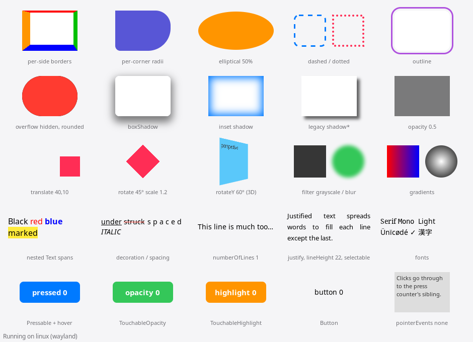

# Components: View, Text and pointer input

What `<View>`, `<Text>` and the pressables do on GTK4 today. The gallery
(`examples/hello-world/Gallery.js`, AppRegistry name `Gallery`) shows most of
it:

```sh
(cd examples/hello-world && npm run bundle)
build/linux/rn-gtk-host --bundle examples/hello-world/build/index.bundle.js \
  --module Gallery --width 940 --height 680 [--self-test]
```



`--self-test` checks pixels for the key cases. These include per-side
borders, corner radii, a rounded overflow clip, box shadows, a transformed
view's position, filters, gradients, nested Text colors and ellipsis. It
also checks that every Text draws at the size Yoga measured, and it clicks
the pressables, hovers one, holds TouchableOpacity and copies selectable
text. It passes on Wayland and X11. `--module GallerySelection
--self-test` checks drag, double- and triple-click and Shift+click
selection, Ctrl+C, the right-click menu, `selectionColor`, and that presses
and wheel scrolling still work around selectable text. `--module
GalleryMouse --self-test` checks `onMouseEnter`/`onMouseLeave` (nested and
on otherwise plain views), `tooltip` through GTK's own picking, and
`onAuxClick` for both buttons, bubbling past flattened views.

**Supported** means it matches iOS/Android for the common cases.
**Partial** means it works with the limits noted. **Not yet** means the
prop is accepted but has no effect.

## View

| Prop | Status | Notes |
| --- | --- | --- |
| `backgroundColor` | Supported | |
| `opacity` | Supported | GTK widget opacity (one offscreen pass per translucent view) |
| `borderWidth`, `border{Top,Right,Bottom,Left}Width` | Supported | per side |
| `borderColor`, `border{Top,Right,Bottom,Left}Color` | Supported | per side; default black |
| `border{Start,End}*` | Supported | resolved by Fabric for the layout direction |
| `borderRadius`, per-corner radii | Supported | percentages give elliptical corners; radii that don't fit scale down like CSS |
| `borderStyle: 'dashed' \| 'dotted'` | Partial | drawn with one stroke: the widest side's width and the top color |
| `borderCurve` | Not yet | circular corners only |
| `overflow: 'hidden'` | Supported | clips children to the rounded outline; hit-testing follows it |
| `boxShadow` (outset, inset, spread, blur, several) | Supported | GSK shadow nodes |
| `shadowColor/Offset/Opacity/Radius` | Partial | drawn as an outset box shadow of the view's box (iOS shades the content's alpha) |
| `elevation` | Not yet | Android only |
| `outlineWidth/Color/Style/Offset` | Supported | dashed/dotted as for borders |
| `transform` (translate, scale, rotate, rotateX/Y/Z, skew, perspective, matrix) | Supported | 2D and 3D, around the centre like iOS/Android |
| `transformOrigin` | Supported | |
| `backfaceVisibility: 'hidden'` | Partial | hides the view when its own transform faces away; ancestors' rotations aren't combined |
| `filter`: brightness, contrast, grayscale, hue-rotate, invert, opacity, saturate, sepia | Supported | GSK color matrices (Filter Effects spec) |
| `filter`: blur, drop-shadow | Supported | GSK blur and shadow nodes |
| `experimental_backgroundImage`: linear-gradient | Supported | angles, `to <side/corner>`, stop positions in % or px |
| `experimental_backgroundImage`: radial-gradient | Partial | circle or ellipse at farthest-corner with a position; explicit sizes not yet |
| `backgroundSize/Position/Repeat` | Not yet | |
| `mixBlendMode`, `isolation` | Not yet | |
| `pointerEvents` | Supported | `none`, `box-none`, `box-only` in hit-testing |
| `hitSlop` | Not yet | |
| `focusable`, `tabIndex`, `onFocus`, `onBlur`, `onKeyDown`, `onKeyUp`, `keyDownEvents`, `keyUpEvents`, `enableFocusRing`, `autoFocus`, `ref.focus()` / `blur()` | Supported | see [Keyboard](#keyboard) |
| `zIndex` | Supported | Fabric orders the children; GTK paints and hit-tests in that order |
| `cursor` | Supported | every RN cursor maps to a GTK/CSS cursor name |
| `nativeID` | Supported | |
| Accessibility props | Supported | see [Accessibility](#accessibility) |

## Text

Text is laid out with Pango. Measuring (TextLayoutManager) and drawing
(RNText) both use `create_pango_layout`. The gallery self-test checks that
every mounted Text draws at the size Yoga measured.

| Prop | Status | Notes |
| --- | --- | --- |
| Nested `<Text>` spans | Supported | each fragment becomes Pango attributes |
| `color`, `fontSize`, `fontFamily`, `fontWeight`, `fontStyle` | Supported | per span |
| Font fallback | Supported | fontconfig fallback (CJK, symbols); names like `serif`/`monospace` work |
| `letterSpacing` | Supported | |
| `lineHeight` | Supported | absolute Pango line height |
| `textDecorationLine` | Supported | underline, line-through, both |
| `textDecorationColor` | Supported | |
| `textDecorationStyle` | Partial | `double` and wavy-ish (`wavy` uses Pango's error underline); dotted/dashed draw solid |
| `textTransform` | Supported | |
| `backgroundColor` on a span | Supported | |
| `textAlign` incl. `justify` | Supported | |
| `numberOfLines` + `ellipsizeMode` head/middle/tail | Supported | |
| `ellipsizeMode: 'clip'` | Supported | measures N lines and clips the rest |
| Padding/border on Text | Supported | text draws inside the content box |
| `selectable` | Supported | mouse drag, double-click (word), triple-click (paragraph), Shift+click; Ctrl+C / Ctrl+Insert and the right-click Copy (the selection, or all with none) and Select All; the primary selection for middle-click paste; an I-beam cursor. One paragraph at a time, as on iOS and Android; no keyboard selection |
| `selectionColor` | Supported | the highlight; without it the theme's selected color at 30% (gray in an inactive window), like GtkLabel |
| `textShadow*` | Not yet | |
| Inline views (`<View>` inside `<Text>`) | Not yet | take no space |
| `adjustsFontSizeToFit`, `allowFontScaling` | Not yet | |
| `onPress` on nested spans | Supported | hit-testing finds the span under the pointer |

## Pointer input

`linux/src/GtkPointerHandler.cc` turns GDK input on each surface root (the
app and LogBox) into Fabric events. It hit-tests our widgets with
transforms, rounded overflow clips, `pointerEvents`, and nested Text spans.

| Feature | Status | Notes |
| --- | --- | --- |
| Touch events (touchStart/Move/End/Cancel) | Supported | mouse primary button and touchscreen points; drive the responder system |
| `Pressable`, `TouchableOpacity`, `TouchableHighlight`, `Button` | Supported | `onPress`, `onPressIn/Out`, `onLongPress`, pressed styles |
| TouchableOpacity fade | Supported | native-driver Animated through C++ Animated (`synchronouslyUpdateViewOnUIThread`) |
| W3C pointer events: down/move/up/cancel, click | Supported | only sent to views (and ancestors) that listen |
| Hover: pointerover/out, pointerenter/leave | Supported | `onHoverIn`/`onHoverOut` on Pressable (W3C hover flag on) |
| `onMouseEnter`, `onMouseLeave` | Supported | react-native-windows / react-native-macos: the mouse entering and leaving the view (not bubbling, mouse only); `nativeEvent` has the pointer event's fields (`clientX`, `offsetX`, modifiers...) |
| `onAuxClick` | Supported | a middle (`button` 1) or right (`button` 2) click, pressed and released on the same view; bubbles (W3C auxclick) |
| `tooltip` | Supported | a GTK tooltip on any view (react-native-windows / react-native-macos) |
| Modifier keys, buttons, pointerType | Supported | `ctrlKey`... `buttons`, `button`, `mouse`/`touch` |
| Right/middle button | Supported | pointer events and `onAuxClick`; right-click opens Copy / Select All on selectable text |
| Text selection by mouse | Supported | selectable Text only; a selection that becomes non-empty cancels the press it began (touchCancel), so a Pressable around selectable text presses on a click, not on a drag |
| Scroll wheel, touchpad | Supported | handled by the ScrollView's GtkScrolledWindow (smooth and kinetic) |
| Keyboard focus, `onKeyDown` | Supported | see [Keyboard](#keyboard) |
| Pen pressure/tilt | Not yet | |

### Button

React Native's `Button.js` styles itself only for `ios` and `android`, so
the package replaces it on Linux (`overrides/Libraries/Components/Button.linux.js`,
picked up by the Metro config like the other overrides) with one that
looks like a GTK (Adwaita) button.

| Prop | Linux |
| --- | --- |
| default | 34px tall, 6px corners, a light neutral background (`#E6E6E6`), dark bold label |
| dark color scheme (`useColorScheme() === 'dark'`) | Adwaita dark: `#3A3A3A` background, white label; hover and press lighten by 5% and 20% |
| `color` | the background (like Android), with a white label; `#3584E4` is Adwaita's accent (suggested-action) |
| `disabled` (or `accessibilityState.disabled`, `aria-disabled`) | half opacity, presses ignored, no hover or pressed shading |
| hover / pressed | 5% darker on hover (10% lighter on a `color`), 20% darker while pressed |
| `title`, `onPress`, `accessibilityLabel`, `testID`, `nativeID`, accessibility and `aria-*` props | as upstream |

The title isn't uppercased (Android does). It follows light and dark
(see [apis.md](apis.md#appearance-and-dark-mode)), not the GTK theme's
own colors. The Gallery self-test checks its colors, corners, hover shade
and that a disabled Button doesn't press; GalleryAppearance checks the
dark variant.

## Keyboard

`linux/src/GtkKeyboardHandler.cc` gives React views GTK's keyboard focus
and keys; the props are spelled as in react-native-windows and
react-native-macos. The `GalleryKeyboard` page (`--module GalleryKeyboard
--self-test`) checks the Tab order both ways, focus events, the focus
ring, key events with modifiers, `keyDownEvents`, Enter/Space presses,
TextInput keys, `autoFocus` and `ref.focus()`/`blur()`, on Wayland and
X11. The self-test feeds key events to the handler and moves focus the
way GtkWindow's Tab binding does: real key presses can't be synthesized
on the test VM. TypeScript: `ViewPropsLinux` and `HandledKeyEvent` in
`types/index.d.ts`.

| Feature | Status | Notes |
| --- | --- | --- |
| Tab / Shift+Tab | Supported | focusable views, TextInputs, Switches, in tree order (a view, then its children, as on the web), wrapping at the ends. Not GTK's geometric order. A multiline TextInput types a Tab; Ctrl+Tab leaves it (GTK) |
| `focusable` (and `tabIndex` 0 / -1) | Supported | Pressable, the Touchables and Button are focusable unless `focusable={false}` or disabled, as on Android. A click focuses the focusable view it lands in. Focusable views are never flattened |
| `onFocus`, `onBlur` | Supported | on a focused View/Pressable; TextInput sends its own |
| Focus ring | Supported | 2px, the theme's accent at half opacity, inside the view's rounded box (Adwaita's button ring); only for keyboard focus (GTK's `:focus-visible`). `enableFocusRing={false}` turns it off (react-native-macos) |
| Enter / Space | Supported | press the focused Pressable, Touchable or Button (Enter on press, Space on release): a `click` without `pointerType`, which Pressability turns into `onPress`, like Android's keyboard clicks |
| `onKeyDown`, `onKeyUp` | Supported | on the focused view (TextInputs and Switches too), bubbling through React. `nativeEvent`: W3C `key` (`"a"`, `"A"`, `"Enter"`, `"ArrowLeft"`, `" "`), `code` (`"KeyA"`, physical, layout-independent), `altKey`, `ctrlKey`, `metaKey` (Super), `shiftKey`, `repeat` |
| `keyDownEvents`, `keyUpEvents` | Supported | `[{key, code, altKey, ctrlKey, metaKey, shiftKey}]`: keys the view (or a descendant's focus) handles itself, so GTK doesn't act on them: Tab won't move focus, a TextInput won't type them, Enter won't press. Match `key` (react-native-macos) or `code` (react-native-windows); a modifier left out matches either way |
| `autoFocus` (View) | Supported | focuses the view once mounted (TextInput's own `autoFocus` too) |
| `ref.focus()`, `ref.blur()` on any view | Supported | ViewCommands `focus`/`blur` (the host turns on React Native's `enableImperativeFocus` flag) |
| Arrow keys | Partial | move focus between views geometrically, as in other GTK apps, unless a view handles them with `keyDownEvents` |
| Keys with nothing focused | Not yet | key events need a focused view, as on react-native-macos |
| `nextFocus*`, `hasTVPreferredFocus` | Not yet | Android/TV only |

## Accessibility

React Native's accessibility props reach screen readers (Orca) and
inspectors (Accerciser) through GTK's GtkAccessible and AT-SPI
(`linux/src/GtkAccessibility.cc`). `AccessibilityInfo` is in
[apis.md](apis.md#accessibilityinfo). The `GalleryAccessibility` page
(`--module GalleryAccessibility --self-test`) reads the app's tree out of
process the way a screen reader does (`scripts/a11y-probe.py`, AT-SPI),
checks roles, names, states, values and actions, and performs actions and
sets a value through AT-SPI; on Wayland and X11.

| Prop | Status | Notes |
| --- | --- | --- |
| `role`, `accessibilityRole` | Supported | mapped to GTK's roles (button, checkbox, togglebutton, link, header → heading, image, adjustable → slider, switch, tab, list...). Set when the view mounts: GTK can't change a role later. A Text is a label; an `accessible` View with no role a named group |
| `accessibilityLabel`, `aria-label` | Supported | the name. A Text is named by its text; an `accessible` View by its descendants' text, as on iOS; buttons and links by their content (GTK) |
| `accessibilityLabelledBy`, `aria-labelledby` | Supported | a labelled-by relation to the views with those `nativeID`s, whose text also becomes the name (GTK 4.14 doesn't derive it) |
| `accessibilityHint` | Supported | the description |
| `accessibilityState`, `aria-disabled/selected/checked/busy/expanded` | Supported | disabled, selected, checked (mixed too; pressed for a togglebutton), busy, expanded |
| `accessibilityValue`, `aria-valuemin/max/now/text` | Supported | AT-SPI's Value interface: such views (and range roles) mount as an `RNRangeView`. A screen reader setting the value sends `onAccessibilityAction` `increment` or `decrement` |
| `accessibilityActions`, `onAccessibilityAction` | Supported | AT-SPI actions named `a11y.<name>`. A view that presses (Pressable, Button) also has `a11y.activate`, which presses it |
| `accessibilityElementsHidden`, `aria-hidden`, `importantForAccessibility="no-hide-descendants"` | Supported | the view and its subtree are left out |
| `importantForAccessibility="no"` | Supported | presentation role: the view isn't an element, its children are |
| `accessible` | Supported | one element (see the name above) |
| Screen reader navigation | Supported | Orca reads what has keyboard focus. While a screen reader runs (AT-SPI's `ScreenReaderEnabled`), `accessible` Views and Texts outside such a View (or a Pressable) take focus too, so Tab visits each element, as VoiceOver and TalkBack swipes do; the Tab order is unchanged otherwise. Orca's flat review (KP_8 / KP_7 / KP_9, or Orca+Up/Down on a laptop layout) reads everything else |
| `accessibilityLiveRegion`, `aria-live` | Supported | a Text's new content inside the region is announced (polite, or assertive at high priority) |
| `accessibilityViewIsModal`, `aria-modal` | Partial | GTK's modal property; GTK doesn't confine screen readers with it |
| TextInput, Switch | Supported | GTK's own text box and switch, with the label, hint, labelled-by and hidden props |
| `accessibilityLanguage`, `accessibilityIgnoresInvertColors`, large content viewer | Not yet | no GTK equivalent |

Views with a role, label, hint, live region or actions are never flattened
by Fabric, so their element exists.

## ScrollView and lists

`<ScrollView>` mounts an `RNScrollView` (`linux/widgets/rn_scroll_view.cc`).
It's a GtkScrolledWindow and GtkViewport around an RNView that holds the
content. React children mount into the content box, sized from Fabric's
`ScrollViewState`. FlatList, SectionList and VirtualizedList are JS on top
of it. The `GalleryLists` page (`--module GalleryLists --self-test`) tests:

- wheel scrolling through the input path;
- onScroll reaching JS;
- `scrollTo`;
- pressing a row through the scroll offset;
- a scroll during a press cancelling it;
- horizontal scrolling;
- FlatList `scrollToIndex`/`scrollToEnd`/`onEndReached` over 10,000 rows with
  bounded mounted views;
- sticky SectionList headers.

| Feature | Status | Notes |
| --- | --- | --- |
| Vertical and horizontal scrolling | Supported | whichever axis the content overflows, like UIScrollView |
| Mouse wheel, touchpad (smooth, kinetic), touchscreen drag | Supported | GTK's scrolled window; a vertical wheel scrolls a sideways-only list sideways |
| Overlay scrollbars, `showsVertical/HorizontalScrollIndicator` | Supported | hidden indicators still scroll |
| `scrollEnabled` | Supported | |
| `onScroll` with `scrollEventThrottle` | Supported | at most one per frame (16 ms) or per throttle, plus a trailing event |
| `contentOffset`, `contentSize`, `layoutMeasurement` in events | Supported | |
| `onScrollBeginDrag/EndDrag`, `onMomentumScrollBegin/End` | Partial | from touchpad and touch gestures and GTK's kinetic deceleration; a mouse wheel only sends `onScroll` |
| `ScrollViewState.contentOffset` | Supported | updated from native (throttled to 100 ms and at rest), as on iOS |
| Commands `scrollTo`, `scrollToEnd` (animated or not), `flashScrollIndicators` | Supported | flash is a no-op (overlay scrollbars show on motion) |
| `contentOffset` prop | Supported | initial offset |
| `contentInset`, `scrollIndicatorInsets` | Not yet | |
| `pagingEnabled`, `snapToInterval`, `snapToOffsets` | Not yet | GTK's scrolled window has no snapping; needs our own deceleration |
| `stickyHeaderIndices` / sticky section headers | Supported | native-driver `Animated.event` on onScroll |
| Nested scroll views | Supported | the innermost one under the pointer scrolls |
| Presses inside, and scroll cancelling a press | Supported | a user scroll sends touchCancel to touches in progress |
| `RefreshControl` | Not yet | needs a native pull-to-refresh component |
| `maintainVisibleContentPosition`, zoom | Not yet | |
| `FlatList`, `SectionList`, `VirtualizedList` (windowing, `inverted`, `horizontal`, `onEndReached`, `scrollToIndex`) | Supported | |

FlatList with 10,000 rows (`getItemLayout`, stable callbacks), scrolled
by a wheel step every frame on the GNOME Wayland session (a VM). JS runs
on its own thread (see [architecture.md](architecture.md)):

| Scroll speed | frame p50 | frame p95 | main-thread CPU per frame | max mounted views |
| --- | --- | --- | --- | --- |
| none (baseline) | 16.7 ms | 16.8 ms | 0.9 ms | |
| 15 px/frame | 16.7 ms | 33.5 ms | 1.1 ms (10.9 ms with JS on the main thread) | 917 |
| 59 px/frame | 16.7 ms | 34.1 ms | 1.2 ms (11.7 ms with JS on the main thread) | 1003 |

Moving JS off the GTK thread cut the main thread's work per scrolled frame
about tenfold. The p95 didn't change: in those frames the main thread is
idle, and this VM's GPU and compositor set the limit. X11 measures the
same.

## Image

`<Image>` is an RNView that draws a texture, so View styling (border radius,
borders, shadows) applies to it too. `linux/imagemanager/ImageManager.cpp`
replaces ReactCommon's stub ImageManager. `GtkImageLoader` handles the
sources below and decodes on a worker thread with GDK (PNG, JPEG, TIFF) or
gdk-pixbuf (other formats). The `GalleryImages` page
(`--module GalleryImages --self-test`, which serves its own http images)
checks pixels for every resize mode, tint, rounded corners, data URIs,
http, assets, `defaultSource` and the load events.

| Feature | Status | Notes |
| --- | --- | --- |
| `require('./x.png')` assets | Supported | dev: Metro's asset URLs; release: `react-native bundle --platform linux --assets-dest` copies them next to the bundle, which the host reports as a `file://` script URL |
| http(s) | Supported | libsoup; `headers` are sent; 128 MB in-memory cache, no disk cache yet |
| `file://` and absolute paths | Supported | |
| `data:` URIs | Supported | base64 or percent-encoded |
| `resizeMode` cover, contain, stretch, center, repeat, none | Supported | |
| `tintColor` | Supported | |
| `borderRadius` and borders | Supported | the image is clipped to the rounded padding box |
| `blurRadius` | Supported | GSK blur |
| `onLoadStart`, `onLoad` (with the source size), `onLoadEnd`, `onError` | Supported | always sent, as on iOS |
| `defaultSource` | Supported | shown until the image loads, and kept if it fails |
| `onProgress`, `loadingIndicatorSource`, `capInsets`, `fadeDuration` | Not yet | |
| `ImageBackground` | Supported | |
| `Image.getSize`, `Image.prefetch`, `queryCache` | Partial | wired to the loader through the ImageLoader module; not covered by the self-test |
| Animated GIF/WebP | Not yet | the first frame shows |

## TextInput, Switch, ActivityIndicator

These are real GTK controls. Typing, selection, input methods (IBus...),
clipboard and undo all come from GTK. The `GalleryControls` page
(`--module GalleryControls --self-test`) types through GTK's editing path
and checks:

- a JS-uppercased controlled input, with the caret kept in place;
- maxLength;
- secure entry hiding the characters;
- multiline growth via onContentSizeChange;
- submit;
- the focus/blur commands and their events;
- that a TextInput inside a Pressable doesn't press it;
- Switch toggling, and a controlled Switch flipping back;
- the spinner animating and hiding when stopped.

`<TextInput>` mounts an `RNTextInput` (`linux/widgets/rn_text_input.cc`): a
GtkText for one line, a GtkTextView for multiline, over an RNView that draws
the input's background and border. Natively it's React Native's iOS C++
TextInput component, which TextInput.js renders on Linux through two small
overrides (`TextInput`, `TextInputState`).

Controlled values follow iOS's protocol. Each native edit bumps an event
count, sends onChange with it, and updates the shadow node's state, so
layout measures the new text. A value from JS is applied only once JS has
seen every edit (its `mostRecentEventCount` matches). Typing never fights
JS, and a value JS rewrites keeps the caret where it was.

| Feature | Status | Notes |
| --- | --- | --- |
| `value` (controlled), `defaultValue`, `onChange`, `onChangeText` | Supported | iOS's event-count reconciliation |
| `placeholder`, `placeholderTextColor` | Supported | |
| `editable`, `readOnly` | Supported | |
| `maxLength` | Supported | characters (code points) |
| `secureTextEntry` | Supported | GTK's invisible characters; password input purpose |
| `multiline`, auto-growing height, `onContentSizeChange` | Supported | measured with the same Pango layout as the shadow node |
| `numberOfLines` | Partial | only from the style height; no line clamp in the editor |
| `onSubmitEditing`, `submitBehavior`, `blurOnSubmit` | Supported | Enter in a single line; in multiline with submit/blurAndSubmit |
| `onFocus`, `onBlur`, `onEndEditing`, `autoFocus` | Supported | |
| Commands `focus`, `blur`, `clear`, `setTextAndSelection` | Supported | stale `setTextAndSelection` calls (older event count) are dropped |
| `selection`, `onSelectionChange` | Supported | offsets in characters (UTF-16 indices differ outside the BMP) |
| `selectTextOnFocus`, `clearTextOnFocus` | Supported | |
| `selectionColor`, `cursorColor`, `caretHidden` | Supported | CSS on the editor |
| `textAlign`, font props, `color`, `letterSpacing` | Supported | CSS on the editor |
| `keyboardType` / `inputMode` | Supported | GtkInputPurpose (email, number, digits, phone, URL) |
| `autoCapitalize`, `autoCorrect`, `spellCheck` | Supported | GtkInputHints, for input methods that use them |
| `onKeyPress` | Supported | characters, Enter, Backspace, Tab, Escape, Delete; input-method commits send onChange only |
| Copy, paste, undo, IME | Supported | GTK's (GtkText/GtkTextView with their GtkIMContext) |
| `returnKeyType`, `enterKeyHint` | Not yet | no on-screen keyboard to label |
| `inputAccessoryViewID`, `textContentType`, autofill | Not yet | |
| `onScroll` (multiline) | Not yet | |
| Nested `<Text>` children | Not yet | the text only |

| Control | Status | Notes |
| --- | --- | --- |
| `<Switch>` `value`, `onValueChange`, `disabled` | Supported | GtkSwitch. A controlled Switch whose value JS keeps flips back through the setValue command, as on iOS. Clicks go to GTK, not to React's responder. |
| `<Switch>` `trackColor`, `thumbColor` | Partial | backgrounds through widget CSS; the theme's borders and shadows stay |
| `<ActivityIndicator>` `animating`, `hidesWhenStopped`, `color`, `size` (small, large, number) | Supported | GtkSpinner sized to the frame |

## Modal

`<Modal>` opens its content in a GTK window of its own, transient for and
modal over the window it was rendered in, as react-native-windows and
react-native-macos do. A modal rendered inside a modal stacks over that
one. `GalleryModal` (`--module GalleryModal --self-test`) opens and
closes each kind and checks the windows, the layout, the events, focus
and what AT-SPI reports; the Showcase has a Modal page to try them.

| Prop | Status | Notes |
| --- | --- | --- |
| `visible` | Supported | `false` plays the closing animation, hides the window, sends `onDismiss`, then unmounts (iOS's order, kept by `Modal.linux.js`) |
| `animationType` | Supported | `none`; `fade` fades the window; `slide` slides the content up from the bottom. Off when GTK animations are (`gtk-enable-animations`) |
| `presentationStyle` | Supported | `fullScreen`/`overFullScreen`: an undecorated window the size of the parent's content, which mutter attaches over it. `formSheet` (540x620) and `pageSheet` (720 wide, nearly the parent's height): a decorated, resizable dialog with a close button, clamped to the parent; the content follows its size |
| `transparent`, `backdropColor` | Supported | the window paints nothing, so the app shows through the content's backdrop (Wayland, and X11 with a compositor). X11 without a compositor paints the window background dimmed instead |
| `onShow` | Supported | once shown, after the opening animation |
| `onRequestClose` | Supported | Escape, or the window's close button; the window stays open until the app hides it |
| `onDismiss` | Supported | after `visible={false}` closed the window |
| `accessibilityLabel` / `aria-label` | Supported | the dialog's title and accessible name (otherwise the parent window's title) |
| `onOrientationChange`, `supportedOrientations`, `statusBarTranslucent`, `navigationBarTranslucent`, `hardwareAccelerated`, `allowSwipeDismissal` | Not applicable | |

Screen readers see a dialog (`GTK_ACCESSIBLE_ROLE_DIALOG`, AT-SPI's
`dialog` role with the `modal` state); Orca reads its name when it opens.
Focus moves to the modal's first focusable view, and the window it was
opened from keeps its own focus for when the modal closes. Each modal's
content is a root for pointer and keyboard input of its own, so presses,
hover, keys and selectable text work in it as in the main window.
`useWindowDimensions()` inside a modal still reports the app's window.

## Context menus

Any View (Pressable and the Touchables too) and TextInput take a
`contextMenu` prop: items the host pops up as a GtkPopoverMenu on
right-click (at the pointer), and on the Menu key or Shift+F10 (pointing
at the focused view). `ContextMenu` from `@curiosity26/react-native-gtk4`
is a View with an `onSelect` for all its items. The nearest view with a
menu shows it: a click on a child without one shows its parent's.

```js
import {ContextMenu} from '@curiosity26/react-native-gtk4';

<View
  contextMenu={[
    {title: 'Open', shortcut: 'Ctrl+O', onSelect: open},
    {title: 'Rename…', shortcut: 'F2', onSelect: rename},
    {type: 'separator'},
    {title: 'Show hidden files', checked: showHidden, onSelect: toggleHidden},
    {title: 'Sort by', items: [
      {title: 'Name', type: 'radio', checked: sort === 'name', onSelect: () => setSort('name')},
      {title: 'Date', type: 'radio', checked: sort === 'date', onSelect: () => setSort('date')},
    ]},
    {title: 'Delete', disabled: !selected, onSelect: remove},
  ]}>
```

| Item | Notes |
| --- | --- |
| `title`, `onSelect(item)` | `onSelect` runs when the item is chosen; the view's `onContextMenuSelect({nativeEvent: {id}})` after it |
| `disabled` (or `enabled: false`) | greyed out |
| `checked`, `type: 'checkbox'` | `checked` alone makes a checkbox. JS owns the state: flip it in `onSelect` and the next menu shows it |
| `type: 'radio'` | radio items between separators are one group; the `checked` one is marked |
| `items` | a submenu |
| `shortcut` | `'Ctrl+Shift+S'`, `'Alt+F4'`, `'F2'`, `'Delete'`, or GTK's `'<Control>s'`: shown next to the item (in the menu bar it also works as an accelerator) |
| `{type: 'separator'}` or `'-'` | a line between sections |

React Native core has no menu API, and react-native-windows'
ContextFlyout and react-native-macos' menus differ; this shape is the
common part, with GTK's model (sections, checkbox and radio items,
accelerators). A TextInput keeps GTK's own menu (Cut, Copy, Paste, Emoji…),
and selectable Text its Copy / Select All, unless they have a
`contextMenu` themselves; an ancestor's menu doesn't replace theirs.
Screen readers see a menu with menu items (check and radio items with
their state); the popover takes keyboard focus, and Escape closes it.

`GalleryMenus` (`--module GalleryMenus --self-test`) right-clicks, presses
Menu and Shift+F10, checks what each menu holds (labels, sections,
submenus, shortcuts, disabled and checked items), chooses items, and checks
the TextInput rules; the Showcase's Menus page has both kinds.

## Drag and drop

With react-native-macos' props: a view's `draggedTypes` say what drops it
takes, and it gets `onDragEnter`, `onDragLeave` and `onDrop`. The nearest
view under the pointer that takes something the drag offers gets it; a
TextInput takes text drops itself (GTK's).

```js
<View
  draggedTypes={['fileUrl', 'string']}
  onDragEnter={() => setOver(true)}
  onDragLeave={() => setOver(false)}
  onDrop={e => {
    setOver(false);
    const {files, urls, text} = e.nativeEvent.dataTransfer;
    files.forEach(f => openFile(f.uri));   // {name, type, uri, size}
  }}
/>
```

| | Notes |
| --- | --- |
| `draggedTypes` | `'fileUrl'`: files and links (a URI list); `'string'`: text; `'image'`: image data |
| `onDragEnter`, `onDragLeave` | `{clientX, clientY, dataTransfer: {files: [], items, types}}`: the drag's MIME types (its data is read only on drop) |
| `onDrop` | `dataTransfer.files`: local files, `{name, type, uri, size}`; image data (`'image'`) saved as a PNG in the user's cache, with `width` and `height`. Linux adds `dataTransfer.urls` (links that aren't files, for `'fileUrl'`) and `dataTransfer.text` (for `'string'`) |
| Dragging out | the selected text of selectable Text (press inside the selection and drag; a click there puts the caret instead), and an Image with `draggable`: its picture, plus its file (a local image) or its URL |

GTK: a GtkDropTargetAsync and a GtkDragSource on each window's (and
Modal's) root; files come through GTK's file transfer (the document portal
in a sandbox). `GalleryDragDrop` (`--module GalleryDragDrop --self-test`)
drags over and drops on its zones through the handler GTK's drop target
calls (files, links, text, an image), and checks what a drag out of
selected text and of a draggable Image carries. Drags from other apps
reach the same handler from GTK's signals, which the self-test can't
start (no synthetic pointer input).

## Performance

The richer styling keeps plain views cheap: the rarely used styles
(shadows, filters, gradients) live off the widget until set. The Phase 0
widget benchmark, run on the GNOME Wayland session with the NGL renderer,
10,000 RNViews, before and after this work:

| moved/frame | frame p50 ms | frame p95 ms | RSS MB |
| --- | --- | --- | --- |
| 100% | 7.1 → 6.7–7.1 | 8.2 → 7.8–8.2 | 28 → 29 |
| 1% | 6.3 → 6.3–6.6 | 7.3 → 6.9–7.6 | 28 → 29 |

(Two runs after; differences are within run-to-run noise.)

## Known differences

- **Shadows draw the view's box.** Like CSS, but unlike iOS's legacy
  `shadow*` props, which shade the content's alpha.
- **3D transforms render in GSK**, but GTK hit-testing through strongly
  rotated or perspective views is approximate.
