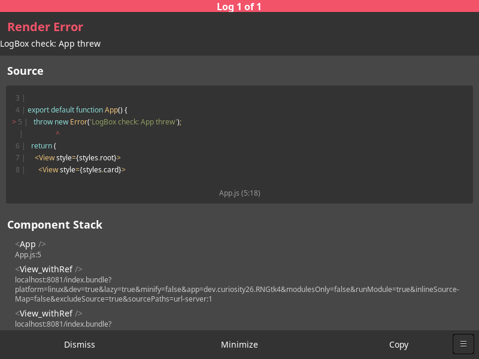

# The dev loop: Metro, reload, fast refresh, LogBox

`rn-gtk-host` can load an app from Metro instead of a bundle file. Saving a
file fast-refreshes the running window, errors show in LogBox, and React
Native DevTools can attach.



## Running it

Build the host first ([building-react-native.md](building-react-native.md);
networking needs `sudo apt install libsoup-3.0-dev`). Then use two
terminals:

```sh
npm run start:hello-world      # 1: Metro for examples/hello-world
npm run dev:hello-world        # 2: the GTK window, loading from Metro
```

`dev:hello-world` runs `build/linux/rn-gtk-host --dev-server localhost:8081`
and passes on any extra arguments. For your own app:

```sh
npx react-native start                       # in the app; needs @react-native-community/cli
rn-gtk-host --dev-server [HOST:PORT] [--entry index] [--module AppName]
```

`--entry` is the entry file's path relative to Metro's project root,
without the extension; the host asks Metro for
`/<entry>.bundle?platform=linux&dev=true&…`. `--module` is the
`AppRegistry` name. `--bundle FILE` still runs release bundles with no dev
tooling.

The app's `metro.config.js` must add the Linux platform (`withLinux`, see
building-react-native.md). `react-native start` comes from
`@react-native-community/cli`, which also provides Metro's `/status`,
`/message` and `/reload` endpoints. Without the CLI, Metro serves bundles but
reloading from Metro's terminal does nothing.

## Keys

| Where | Key | Does |
| --- | --- | --- |
| window | Ctrl+R | Reload the JS |
| window | Ctrl+D or Ctrl+M | Dev menu: Reload, Open DevTools |
| window | the ☰ button (bottom right) | Dev menu |
| Metro terminal | `r` | Reload every connected app |
| Metro terminal | `j` | Open React Native DevTools |

## What works

- **Loading from Metro.** While the bundle downloads, a blue
  "Loading from Metro…" banner shows. If Metro isn't running, a red banner
  says so; start Metro and press Ctrl+R.
- **Reload.** Ctrl+R, the dev menu, Metro's `r`, and LogBox's own reload
  all go through `DevSettings.reload()` and ReactHost's reload. The old JS
  instance is torn down, the surface re-mounts into the same root widget,
  and every widget from the old tree is released.
- **Fast refresh.** HMR runs over `ws://…/hot` with `platform=linux`.
  Saving a component updates the running UI in the same JS instance (no
  reload), so React Fast Refresh can keep component state. HMR's
  "Refreshing..." message shows in the banner.
- **LogBox.** Warnings and errors show in LogBox. A thrown error opens the
  full-window red LogBox, with the code frame and component stack
  symbolicated by Metro. It is its own React surface in a layer over the app
  (`RNGtkHost::LogBoxDelegate`).
- **Errors before JS runs.** If Metro can't build the bundle on the first
  load, LogBox can't run yet. A red banner shows the compiler error; fix it
  and press Ctrl+R.
- **React Native DevTools.** The host connects to Metro's inspector proxy by
  default (`--no-inspector` turns that off). The app is listed in Metro's
  `/json/list` as a Fusebox target, and CDP `Runtime.evaluate` through the
  proxy works. `j` in Metro and "Open DevTools" in the dev menu
  (`POST /open-debugger`) should open DevTools in Chrome; that wasn't
  tried on the test VM.
- **Networking for apps.** The same libsoup clients back `fetch`,
  `XMLHttpRequest` and `WebSocket`, in release builds too.

## How it fits together

- `linux/src/SoupNetworking.cc` implements ReactCxxPlatform's `IHttpClient`
  and `IWebSocketClient` on libsoup 3. All soup work runs on one
  `rngtk-network` thread with its own `GMainContext`, never on the GTK main
  loop: `DevServerHelper` blocks on a future while the bundle downloads, and
  that wait must not depend on the thread it blocks. Callbacks arrive on the
  network thread; React Native's consumers hop to the JS thread themselves.
- ReactCxxPlatform's `DevServerHelper` asks Metro for `platform=android`
  (upstream T159303412). `linux/CMakeLists.txt` compiles a copy that asks for
  `platform=linux`, for both the bundle URL and HMR setup. The configure step
  fails loudly if upstream changes that line.
- JS runs on the GTK main thread. ReactHost reloads on a thread of its own,
  so `GtkMessageQueueThread::quitSynchronous()` waits until the main thread
  is between two JS tasks. `GtkMountingManager` queues transactions that
  arrive off the main thread (stopping surfaces during a reload) and applies
  them on the main thread, in order. Root widgets survive the reload.
- `linux/src/DevUI.cc` implements `IDevUIDelegate`: the banner, the
  debugger-paused bar and the dev menu button, in the window's `GtkOverlay`.

## Testing

```sh
npm run test:dev-loop                      # or scripts/test-dev-loop.sh
GDK_BACKEND=x11 npm run test:dev-loop
```

The script starts Metro, or reuses one that is already running. It runs
`rngtk-net-check`, which checks `GET /status`, a POST, a refused connection
and the `/message` WebSocket. Then it runs `rn-gtk-host --dev-server
--self-test` with these checks:

1. the Hello World checks on the bundle from Metro;
2. a reload through the host (what Ctrl+R calls), then a reload sent by
   Metro (`POST /reload`, what `r` sends); each re-runs the checks and
   requires the same number of mounted views (no leaked widgets);
3. fast refresh: the script edits App.js's subtitle and the host waits for
   the new text with the same JS instance (no reload);
4. LogBox: the script makes `App` throw and the host waits for LogBox.
   `LOGBOX_SCREENSHOT=path.png` saves the window at that point. Then the
   host clicks LogBox's Dismiss button and waits for LogBox to close.

App.js is restored when the script exits.

## Known gaps

- **No keyboard input to React views yet** (Phase 2). Mouse and touch work
  (see [components.md](components.md)), and LogBox's buttons can be
  clicked: the dev-loop test clicks Dismiss.
- **Download progress.** `DevServerHelper` doesn't ask Metro for a
  multipart progress stream, so the banner can't show a percentage.
- **Metro's `d` key.** ReactCxxPlatform ignores Metro's `showDevMenu`
  message. Use Ctrl+D in the window.
- **No Toggle Fast Refresh** in the dev menu yet.
- **LogBox shares the main window.** It doesn't open a separate window, and
  it's sized to the surface.
- **Networking.** `fetch` with a `Blob` body isn't supported (there is no
  Blob module yet). WebSocket `ping()` turns on libsoup keepalive pings,
  since libsoup can't send a single ping. Binary WebSocket messages arrive
  as strings.
- **Keyboard shortcuts aren't tested automatically.** AT-SPI couldn't
  synthesize key events on the test VM. The script calls the same reload
  that Ctrl+R calls, but the key bindings themselves (Ctrl+R, Ctrl+D) need
  a check by hand.
