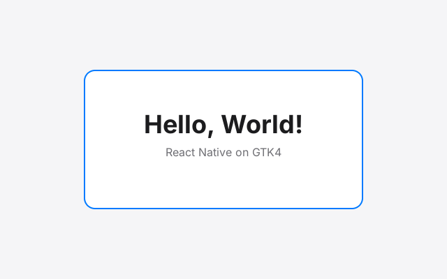

# Phase 0 results: GTK4 Hello World and widget benchmark

Measured 2026-10-08 in a cloud container: Ubuntu 24.04, GTK 4.14.5, 4 vCPU,
**no GPU** (Mesa llvmpipe software GL). Treat the frame times as relative,
not absolute. Real numbers come from running `scripts/bench-matrix.sh` with
`BACKENDS=native` on a desktop VM.

## Hello World

`hello-world --self-test` passes all 9 checks on X11 (Xvfb), Wayland under
GNOME's compositor (mutter 46 headless) and Wayland under Weston 13:
background, rounded corner and border pixels, text drawn inside its frame,
the text node allocated exactly at its (Yoga-style) frame, and the
off-main-thread Pango measurement matching the widget's own layout to the
pixel (228px for the title on every backend).

## Benchmark

`widget-benchmark` mounts N views in rows (every 10th view is a text node),
animates "moved/frame" of them every frame for 120 frames, then unmounts.
`rnview` is our widget; `fixed` builds the same tree from `GtkFixed` as a
baseline. `GL` is the renderer GTK picked by default here; `Ngl` is the newer
renderer forced with `GSK_RENDERER=ngl`.

| backend | renderer | mode | views | moved/frame | mount ms | mount→paint ms | frame p50 ms | frame p95 ms | layout ms | paint ms | RSS MB |
|---|---|---|---:|---:|---:|---:|---:|---:|---:|---:|---:|
| x11 | GL | rnview | 1000 | 100% | 4 | 52 | 17.3 | 22.8 | 1.2 | 13.8 | 39 |
| x11 | GL | rnview | 1000 | 1% | 5 | 57 | 12.2 | 23.5 | 1.1 | 9.3 | 39 |
| x11 | GL | rnview | 10000 | 100% | 47 | 388 | 110.7 | 134.6 | 4.4 | 105.9 | 56 |
| x11 | GL | rnview | 10000 | 1% | 45 | 371 | 108.2 | 121.5 | 4.0 | 102.9 | 57 |
| x11 | GL | fixed | 1000 | 100% | 7 | 61 | 19.7 | 31.2 | 1.6 | 15.1 | 39 |
| x11 | GL | fixed | 1000 | 1% | 6 | 56 | 11.2 | 19.6 | 1.2 | 7.9 | 39 |
| x11 | GL | fixed | 10000 | 100% | 60 | 350 | 98.9 | 128.9 | 10.0 | 83.0 | 85 |
| x11 | GL | fixed | 10000 | 1% | 56 | 313 | 77.5 | 93.2 | 9.0 | 68.9 | 85 |
| x11 | Ngl | rnview | 1000 | 100% | 5 | 64 | 23.7 | 29.2 | 1.2 | 19.1 | 39 |
| x11 | Ngl | rnview | 1000 | 1% | 5 | 65 | 8.6 | 16.8 | 1.3 | 4.6 | 39 |
| x11 | Ngl | rnview | 10000 | 100% | 46 | 187 | 47.8 | 59.2 | 3.7 | 42.7 | 79 |
| x11 | Ngl | rnview | 10000 | 1% | 46 | 179 | 47.0 | 57.0 | 4.0 | 43.0 | 79 |
| x11 | Ngl | fixed | 1000 | 100% | 6 | 62 | 23.4 | 29.3 | 1.5 | 17.9 | 39 |
| x11 | Ngl | fixed | 1000 | 1% | 6 | 67 | 7.2 | 9.9 | 1.2 | 3.2 | 39 |
| x11 | Ngl | fixed | 10000 | 100% | 58 | 216 | 78.2 | 97.2 | 9.5 | 58.8 | 79 |
| x11 | Ngl | fixed | 10000 | 1% | 62 | 227 | 56.3 | 69.3 | 8.8 | 47.8 | 79 |
| wayland | GL | rnview | 1000 | 100% | 5 | 39 | 14.6 | 21.3 | 0.3 | 14.8 | 35 |
| wayland | GL | rnview | 1000 | 1% | 4 | 36 | 10.1 | 17.1 | 0.2 | 10.5 | 35 |
| wayland | GL | rnview | 10000 | 100% | 45 | 365 | 106.0 | 129.6 | 3.3 | 102.1 | 53 |
| wayland | GL | rnview | 10000 | 1% | 47 | 311 | 79.0 | 91.8 | 3.2 | 76.6 | 116 |
| wayland | GL | fixed | 1000 | 100% | 9 | 53 | 17.6 | 21.5 | 0.8 | 16.2 | 35 |
| wayland | GL | fixed | 1000 | 1% | 9 | 55 | 10.3 | 17.0 | 0.3 | 10.5 | 35 |
| wayland | GL | fixed | 10000 | 100% | 58 | 255 | 92.2 | 111.7 | 8.2 | 80.9 | 83 |
| wayland | GL | fixed | 10000 | 1% | 57 | 256 | 75.5 | 90.8 | 7.9 | 69.2 | 83 |
| wayland | Ngl | rnview | 1000 | 100% | 5 | 24 | 24.9 | 30.6 | 0.6 | 24.3 | 4 |
| wayland | Ngl | rnview | 1000 | 1% | 5 | 29 | 5.7 | 9.1 | 0.2 | 5.8 | 9 |
| wayland | Ngl | rnview | 10000 | 100% | 49 | 150 | 53.1 | 72.2 | 3.1 | 50.0 | 48 |
| wayland | Ngl | rnview | 10000 | 1% | 50 | 153 | 52.2 | 66.2 | 3.1 | 50.1 | 48 |
| wayland | Ngl | fixed | 1000 | 100% | 6 | 27 | 24.3 | 31.5 | 0.7 | 22.8 | 9 |
| wayland | Ngl | fixed | 1000 | 1% | 7 | 30 | 5.5 | 8.5 | 0.3 | 5.5 | 9 |
| wayland | Ngl | fixed | 10000 | 100% | 59 | 182 | 81.2 | 103.5 | 8.9 | 65.9 | 49 |
| wayland | Ngl | fixed | 10000 | 1% | 62 | 181 | 56.5 | 72.8 | 8.5 | 49.4 | 49 |

## What this tells us

1. **Mounting 10,000 native views is cheap.** About 45-50 ms to create and
   insert, 3-4 ms for GTK to allocate them, roughly 2x faster layout than the
   `GtkFixed` baseline because our `size_allocate` reads Yoga frames directly
   instead of measuring children. This confirms the research decision not to
   build on `GtkFixed`.
2. **Painting is the cost, and it scales with total view count, not changed
   views.** Moving 1% of 10k views costs about the same as moving all of them.
   In this container every frame is a full software redraw (no buffer-age
   damage on Xvfb or headless compositors). Whether GTK's damage tracking
   rescues this on a real GPU is the main question for the VM run.
3. **Renderer choice matters.** With `ngl`, 10k views paint in about 43-50 ms
   versus about 100 ms on the old `gl` renderer, which handles our per-view
   rounded clip poorly. `ngl` also beats the `GtkFixed` baseline. Follow-ups:
   check which renderer GTK picks on real hardware, and draw rounded
   backgrounds without a clip (for example as a border node) so the old
   renderer gets a fast path.
4. **1,000 views is comfortably interactive** even in software (5-15 ms
   frames on Wayland, 9-17 ms on X11).
5. **X11 and Wayland behave the same** for layout and paint. One real
   difference found: on Wayland a client-side title bar is part of the
   window's default size, so the RN root view must size the window (no
   `gtk_window_set_default_size`), which is what the spike now does.

## Not covered yet

Running on a real desktop with a GPU (the Ubuntu 24.04 VM), Mint Cinnamon,
fractional scaling, and the actual React Native runtime (Fantom/ReactCxxPlatform
build), which is the next step of Phase 0.
